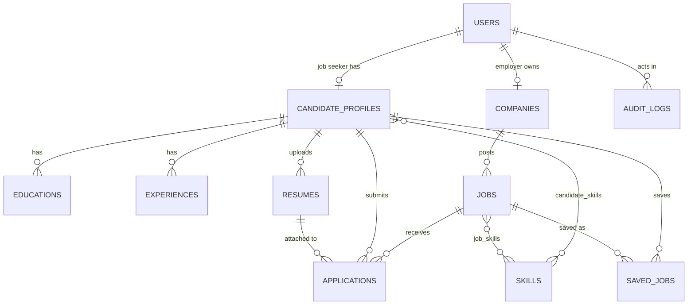

# SkillBharat MVP: implementation plan

Scope guard: one hiring workflow, nothing else.

> Job Seeker → Find Job → Apply → Employer Reviews → Shortlist / Reject → Admin Oversees

Architecture: a **modular monolith**. One Spring Boot service (`com.skillbharat`) with one PostgreSQL database, one React single-page app. No microservices, Kafka, Redis, Kubernetes, LLM, search engine or native apps.

## 1. Database / ERD

Flyway owns the schema (`backend/src/main/resources/db/migration`). Hibernate only validates it (`ddl-auto: validate`).

| Entity | Notes |
|---|---|
| `users` | email (unique, case-insensitive), BCrypt hash, `role` (`JOB_SEEKER`, `EMPLOYER`, `ADMIN`), `active` flag |
| `candidate_profiles` | one per job seeker: headline, city, state, summary, experience years |
| `educations`, `experiences` | children of the profile, replaced as a set on save |
| `skills` | 75 reference skills in 15 trade categories (loaded by migration V2) |
| `resumes` | metadata + storage key. A candidate's current resume is the latest upload |
| `companies` | one per employer. `status`: `PENDING` → `APPROVED` / `REJECTED` |
| `jobs` | `status`: `DRAFT` → `PENDING_APPROVAL` → `APPROVED` / `REJECTED`, plus an admin `active` switch |
| `applications` | unique per (job, candidate). `status`: `APPLIED` → `SHORTLISTED` / `REJECTED`. Keeps the resume that was on file when applying |
| `saved_jobs` | unique per (candidate, job) |
| `audit_logs` | actor, action, entity, details, timestamp |

`Role` is an enum column rather than a table: there are exactly three fixed roles and they drive URL-level access rules.

## 2. Backend modules and API

Package layout: `web` (controllers + DTOs) → `service` (business rules, transactions) → `repository` (Spring Data) → `domain` (JPA entities). Cross-cutting: `security`, `config`, `common` (errors), `storage` (file abstraction), `bootstrap` (admin + demo data).

| Module | Responsibility |
|---|---|
| Auth | register (candidate, employer + company), login, `me`, JWT issue |
| Public jobs | search, detail, filter metadata (categories with open-job counts) |
| Candidate | profile, resume upload, apply, saved jobs, my applications |
| Employer | company profile, jobs (create/edit/submit), applications, decisions |
| Admin | dashboard, users, employer + job moderation, applications, audit log |
| Resumes | authenticated download with access check |
| Storage | `FileStorage` interface; `LocalFileStorage` today, S3/GCS/Blob later |

All 41 endpoints are listed in [API.md](API.md) and live at `/swagger-ui.html`.

## 3. Frontend pages and routes

React + TypeScript + Vite + Tailwind. Route guards are a convenience only; the server enforces every rule.

| Area | Routes |
|---|---|
| Public | `/` landing, `/jobs` search, `/jobs/:id` detail, `/login`, `/register` |
| Job seeker | `/candidate` overview, `/candidate/profile`, `/candidate/applications`, `/candidate/saved` |
| Employer | `/employer` overview, `/employer/company`, `/employer/jobs`, `/employer/jobs/new`, `/employer/jobs/:id/edit`, `/employer/applications`, `/employer/applications/:id` |
| Admin | `/admin` overview, `/admin/employers`, `/admin/jobs`, `/admin/users`, `/admin/applications`, `/admin/audit` |

Every data screen has loading, empty, error and success (toast) states.

## 4. Authentication and RBAC

- Stateless JWT (HS256, 8 h). The filter reloads the user from the database on every request, so **deactivating an account takes effect immediately**.
- URL rules: `/api/candidate/**` → `JOB_SEEKER`, `/api/employer/**` → `EMPLOYER`, `/api/admin/**` → `ADMIN`, `/api/public/**` and login/register open, everything else authenticated.
- Ownership rules live in the services (a URL rule alone cannot express them):
  - a candidate only ever loads their own profile, applications and saved jobs (looked up from the token, never from a client-supplied id);
  - an employer only reaches jobs and applications of their own company; someone else's ids return `404`;
  - resume download: owner, admin, or the employer who received it with an application. Others get `404`;
  - jobs are public only when approved **and** switched on **and** the employer is approved **and** the employer account is active.
- Public registration can only create `JOB_SEEKER` or `EMPLOYER`. Admins come from `ADMIN_EMAIL`/`ADMIN_PASSWORD` or the demo seed.
- All request bodies are validated (Jakarta Validation); errors come back as `{status, message, fieldErrors}`.
- Resumes: PDF/DOC/DOCX only, 5 MB, extension **and** file signature checked, stored under a random UUID name.

## 5. Core workflows

**Candidate**: register → complete profile → upload resume → search → view details → apply → track (`Applied` / `Shortlisted` / `Rejected`).

**Employer**: register with company → wait for admin approval → create job → submit → admin approval → receive applications → review candidate + resume → shortlist / reject.
Editing a live or rejected job returns it to `DRAFT` (it must be approved again).

**Admin**: sign in → approve/reject employers and jobs (reason required on reject) → activate/deactivate users and jobs → monitor users, jobs, applications and the audit log. Every admin action, and every employer shortlist/reject, is written to the audit log in the same transaction.

**Success scenario** (automated in `backend/src/test/java/com/skillbharat/WorkflowIT.java`):
candidate registers → profile → resume → finds job → applies → employer sees application → employer shortlists → candidate sees `SHORTLISTED` → admin sees the whole trail.

## Build order used

1. Schema + migrations, entities, repositories
2. Security (JWT, RBAC), error handling, validation
3. Services and controllers per module, then the seed data
4. Frontend shell, auth, public pages, then candidate → employer → admin areas
5. Docker Compose, docs, end-to-end test
